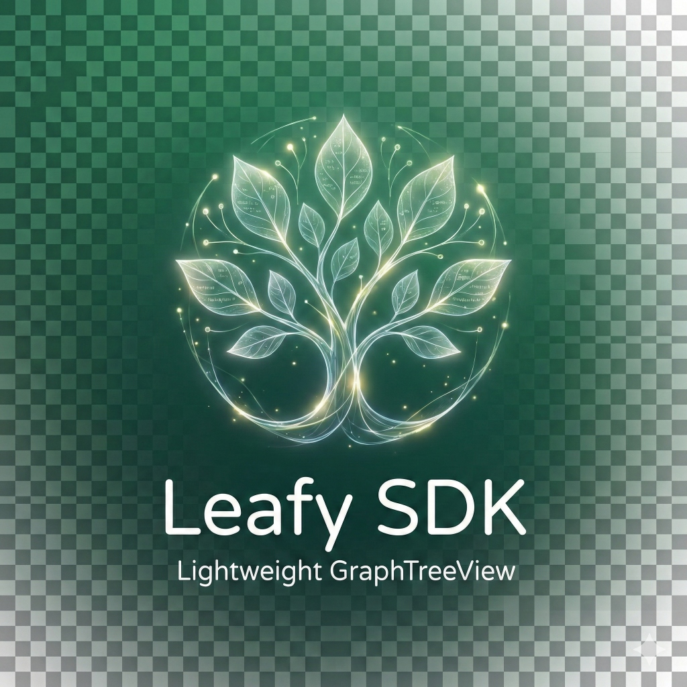
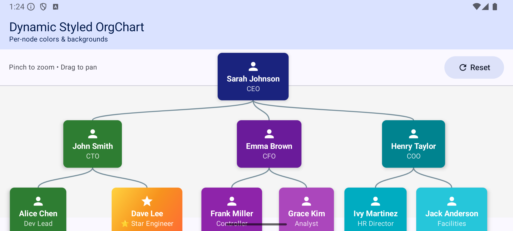

# 

<div align="center">

# Leafy SDK
### Data Unbound by Gravity.

[](LICENSE)
[](https://developer.android.com)
[]()
[](https://jitpack.io/#Colibri91/LeafyGraph)

</div>



---

## 🌌 The Antigravity Pitch

**Gravity is not for your data.**

Traditional graph libraries are heavy. They weigh down your codebase, drag on your UI thread, and slow down the user experience. **Leafy SDK** was designed to break these chains.

Built on the principle of zero friction, Leafy visualizes your complex hierarchical data as if it were floating in mid-air. Thanks to its weightless architecture, tree structures with thousands of nodes are rendered with fluid elegance.

Your data is no longer a list, it is a **living organism**.

## 🚀 Zero-G Highlights

*   **🪶 Feather-Light Core:** No unnecessary payload. Just pure, optimized Kotlin and Compose power.
*   **⚡ Light-Speed Render:** Our custom `Canvas` based drawing engine eliminates the performance cost of standard UI components.
*   **🔗 Organic Node Connections:** Connections between nodes feel natural and organic with fluid Bezier curves instead of static lines.
*   **🔭 Infinite Exploration:** With the built-in `ZoomPanContainer`, your users can freely roam the data universe, zooming in and out.
*   **🎨 Dynamic Atmosphere:** Change the color, shape, and style of every node dynamically at runtime.

## 🔥 Ignition (Installation)

Preparing for liftoff takes just seconds. Leafy is available via **JitPack**.

**1. Add the repository:**
Add this to your `settings.gradle.kts` (or root `build.gradle.kts`):

```kotlin
dependencyResolutionManagement {
    repositories {
        google()
        mavenCentral()
        maven { url = uri("https://jitpack.io") } // <--- Add this
    }
}
```

**2. Add the dependency:**
Add the SDK to your module's `build.gradle.kts`:

```kotlin
dependencies {
    implementation("com.github.Colibri91:LeafyGraph:1.0.0") // Replace '1.0.0' with the latest version
}
```

## 🛸 Liftoff (Quick Start)

You don't need complex configurations to put your data into orbit. Just define your nodes and launch:

```kotlin
// 1. Define Data Capsule
val missionControl = gtwNode("Mission Control", color = DeepSpaceBlue) {
    gtwNode("Booster Stage", color = RocketRed)
    gtwNode("Orbital Module", color = StarlightWhite) {
        gtwNode("Satellite Alpha")
        gtwNode("Satellite Beta")
    }
}

// 2. Launch View
GraphTreeView(
    root = missionControl,
    config = GraphConfig(
        lineStyle = LineStyle.Bezier, // Organic flow
        physics = ZeroGravity       // Weightless feel
    )
) { node, color, _ ->
    // 3. Render Your UI Component
    OrbitCard(
        title = node.data,
        atmosphereColor = color
    )
}
```

---

<div align="center">

**Leafy SDK** — *Code lighter. Fly higher.*

[Documentation](docs/) • [Examples](app/) • [Contribute](CONTRIBUTING.md)

</div>
